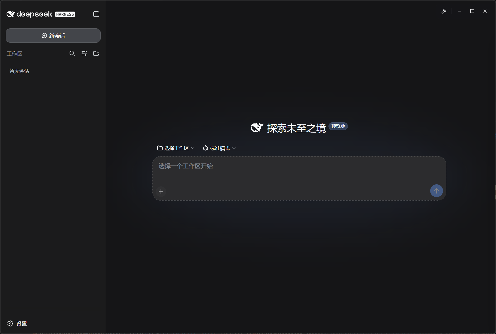

<p align="center">
  <a href="https://github.com/tfcup/deepseek-harness-desktop">
    
  </a>
</p>

<h1 align="center">DeepSeek Harness 桌面版</h1>

<p align="center">
  <em>DeepSeek Harness 的 macOS 原生桌面应用 —— 本地一键运行完整 agent 平台，自动跟随官方更新，可自定义主题 / UI / 工具，全程不改任何官方源码。</em>
</p>

<p align="center">
  <a href="https://github.com/tfcup/deepseek-harness-desktop/releases/latest">
    
    
    
  </a>
  
  
  
</p>

<p align="center">
  <a href="https://github.com/tfcup/deepseek-harness-desktop/releases/latest"><strong>⬇ 下载最新 DMG</strong></a>
</p>

<p align="center">
  <samp>
    <a href="./README.md">English</a> ·
    <strong>中文</strong>
  </samp>
</p>

> **状态：开发预览。** 上游 `dsh` 仍在快速迭代，存在破坏性变更；本项目通过自动化流水线紧密跟随。

## 功能

- **本地一键运行** — DMG 内置预构建的 Baseline Runtime（Harness + Extension Pack），首启离线种入、零下载启动；只需本机装有 Node.js。
- **自动跟随官方更新** — 定时流水线检查官方 `@deepseek-ai/dsh` 新版本，构建并验证后，把该精确 Runtime 嵌入新的完整 Desktop Release。
- **不改官方源码的自由定制** — Extension Pack（主题 / UI / 工具 / 集成）全部通过官方扩展机制注入（`ctx.theme.register`、`ctx.slots`、`ctx.tools.register` 等），不 patch 任何官方文件。
- **数据隔离** — 独立数据目录（`~/Library/Application Support/Deepseek-Harness-Desktop/`）与 CLI `dsh` 的 `~/.dsh` 互不干扰；启动时若发现 3080 端口有任何监听者（如外部 CLI dsh），先结束监听者再拉起自己的隔离实例，绝不"采纳"外部实例。
- **轻量原生** — Tauri 2 外壳（系统 WebKit，非自带 Chromium）：标准 macOS 标题栏 + 红绿灯、主题色标题栏、System 主题同步、双击最大化。

> **为什么用 Tauri 而不是 Electron？** 相同功能下它更轻：更小的安装包、更低的内存占用、更跟手的原生窗口控制——对可能要常驻后台的本地 agent 尤为重要；内嵌的是系统 WebKit 而非自带 Chromium，进一步缩小安装体积。

## 界面预览



## 快速开始

1. 在 [Releases](https://github.com/tfcup/deepseek-harness-desktop/releases/latest) 页面下载最新的 `DeepseekDesktop_<版本>_arm64.dmg`；
2. 打开 DMG，把应用拖入 Applications；
3. **首次打开**：应用以**未签名**形式分发（ad-hoc 签名，未接入 Apple Developer 签名），macOS Gatekeeper 首次会拦截：
   - 若提示 **"应用程序已损坏，无法打开"**——文件**并没有损坏**，这是对"ad-hoc 签名 + 下载隔离属性"的误导性报错。在终端执行一次后重新打开即可：
     ```bash
     xattr -dr com.apple.quarantine "/Applications/Deepseek Harness Desktop.app"
     ```
   - 若提示的是普通的"无法验证开发者"，也可用 **右键点击应用 → 打开 → 再点打开**（仅首次）放行。
4. 应用**离线开箱即用**：首启自动种入内置 Baseline Runtime 并启动服务，就绪后内嵌 Harness 界面打开在 `http://127.0.0.1:3080`。

> 一切都在本地完成。Harness **设置 → 常规 → 应用更新**是唯一更新入口；完整 App 更新通过 Tauri 密钥验证，重启后校验并激活内置的新 Harness Runtime，失败会自动恢复上一版本。

### 系统要求

- macOS 11+（**仅 Apple Silicon / arm64**）
- **本机需已安装 Node.js v22.15+ / v23.8+ / v24+**——无需 Rust / pnpm / Docker

应用**直接使用本机安装的 Node.js**（按 PATH → 登录 shell → Homebrew / nvm 顺序解析）。本机缺失或不兼容时应用会**明确报错**，绝不联网下载或内置运行时。

## 更新机制

项目只有一条用户更新路径：`upstream-watch` 检测官方 Harness，`runtime-build` 固定版本并通过
Compatibility Gate，随后 `desktop-release` 把同一个 Artifact 嵌入新的 patch Release。新用户
下载 DMG；已安装 App 检查 `latest.json` 并安装同一 Release 中签名的 `.app.tar.gz`。Runtime
版本只在内部用于安全激活和自动回滚，不再单独发布或展示。

## 工作原理

```text
┌──────────────────────────────────────────────────────────────┐
│ 应用壳 — Tauri 2 + React（原生标题栏、System 主题）           │
│   boot()：校验内置 Runtime → 启动服务 → iframe → Harness 界面 │
│   Harness 设置：唯一的 Desktop App 更新入口                  │
└──────────────────────┬───────────────────────────────────────┘
                       │ 精简 invoke 桥
┌──────────────────────┴───────────────────────────────────────┐
│ Rust 后端                                                     │
│   process/    dsh 生命周期：无条件重建——3080 端口任何监听者   │
│               （含外部 CLI dsh）先结束，再用隔离的 $DSH_HOME   │
│               拉起自己的实例（仅杀 lsof -sTCP:LISTEN 监听者） │
│   runtime/    内置版本激活、健康检查与自动回滚                 │
│   config/     本机 Node 解析、设置、主题、i18n                │
│   service/    主题偏好同步 + 本地解压                         │
└──────┬───────────────────────────────┬───────────────────────┘
       │                               │
  packages/ (Extension Pack)      runtime/versions/<v>/
  主题 · UI · 工具 · 集成 ——       （CI 流水线构建，随 DMG
  通过官方扩展点注入，不改官方     内置为 baseline，随 App 更新）
       └──────────────┬──────────────┘
                      ▼
   node dsh --profile web --host 127.0.0.1 --port 3080
                      │  DSH_HOME=<app-data>/data/dsh
                      ▼
         http://127.0.0.1:3080/  ← 内嵌 Harness 界面
```

- Harness 内核只来自官方 npm 包 `@deepseek-ai/dsh`，由 CI 固定精确版本后构建。
- Runtime 快照版本化（`YYYY.MM.DD.N`），发布前经过 Compatibility Gate 验证，安装带 SHA-256 校验且可回滚。
- 实现架构详见 [docs/ARCHITECTURE.md](docs/ARCHITECTURE.md)；原始设计文档见 [docs/deepseek-harness-desktop-macos-arm64-design.md](docs/deepseek-harness-desktop-macos-arm64-design.md)。

## 数据目录

数据目录为 Application Support 下的自定义命名目录（同 Chrome/VS Code 的做法，不叫 bundle id）：

- macOS：`~/Library/Application Support/Deepseek-Harness-Desktop/`

包含：

- `runtime/versions/<v>/`：版本化 Harness Runtime（current / previous）
- `data/dsh/`：Harness 用户数据（`$DSH_HOME`，含 profile、会话、设置），与 CLI `dsh` 的 `~/.dsh` 隔离
- `logs/`：应用与 dsh 服务日志
- `.store.dat`：桌面端配置（安装状态、端口、语言）

## 开发与构建

### 环境要求

- Node.js 20+
- Rust（stable）
- pnpm 11（`corepack enable`，或用 `corepack pnpm`）
- macOS Xcode Command Line Tools

### 本地开发

```bash
git clone https://github.com/tfcup/deepseek-harness-desktop.git
cd deepseek-harness-desktop
corepack pnpm install
corepack pnpm tauri dev
```

### 本地构建 DMG

```bash
# 一次性：准备 baseline runtime zip（需要网络 + npm）
bash scripts/prepare-baseline.sh

cd apps/desktop
export PATH="$HOME/.cargo/bin:/tmp/pnpm-shim:$PATH"
export TAURI_SIGNING_PRIVATE_KEY="$(cat "$PWD/../../updater/keys/desktop-updater.key")"
export TAURI_SIGNING_PRIVATE_KEY_PASSWORD="dev-only-key-do-not-use-in-prod"
corepack pnpm tauri build --target aarch64-apple-darwin
# → bundle/dmg/*.dmg + bundle/macos/*.app.tar.gz + *.sig
```

> `tauri-plugin-updater` 已启用，所以构建必须带签名配置；上面用的是仓库内 gitignore 的开发密钥。若上次构建的 DMG 仍挂载着，先 `hdiutil detach "/Volumes/Deepseek Harness Desktop"`。

### 走 CI 发布（推荐）

无需本地工具链——CI 会构建 DMG 和签名的 Updater 产物。手动运行
`desktop-release` 时，版本留空会在最新 `vX.Y.Z` tag 上自动递增 patch，也可以输入明确版本：

```bash
git add -A && git commit -m "..."
git push origin main                         # 触发 desktop-test（质量门）
# GitHub Actions → desktop-release → Run workflow → version 留空（自动 +1）
# 也可继续推送明确的 vX.Y.Z tag 触发发布
```

工作流会把解析后的版本作为 Tauri 构建覆盖值，并统一用于 DMG 名称、更新清单、tag 和 GitHub Release。

### CI 工作流

| 工作流 | 触发方式 | 职责 |
| --- | --- | --- |
| [`upstream-watch.yml`](.github/workflows/upstream-watch.yml) | 每小时或手动运行 | 比较 npm 最新 Harness 与 `runtime/.known-version`，发现新版本后触发 Runtime 构建 |
| [`runtime-build.yml`](.github/workflows/runtime-build.yml) | 上游监控或手动运行 | 固定 Harness、构建 Runtime、执行 Compatibility Gate、调用 Desktop Release，并在完整发布成功后确认已知版本 |
| [`desktop-release.yml`](.github/workflows/desktop-release.yml) | Runtime 构建、`v*` tag 或手动运行 | 使用已验证的 Runtime Artifact 或已确认 Harness 版本构建 DMG、签名 Updater 包和 `latest.json` |
| [`desktop-test.yml`](.github/workflows/desktop-test.yml) | push 或 PR 到 `main` | 执行 Rust、前端和 Extension Pack 质量门禁 |

Runtime 构建不会创建独立 GitHub Release。自动流水线只有在 Desktop Release 成功后才更新
`.known-version`，因此任何构建或发布失败都会在下一轮上游检查时得到重试机会。

手动执行 `desktop-release` 时，`version` 留空会对最高 `vX.Y.Z` 自动增加 patch；填写版本则严格使用指定版本。

## 常见问题

- **3080 端口被占用？** 应用会结束 3080 端口上的监听进程（**仅 LISTEN socket**，绝不碰只持有普通连接的进程，如浏览器），再启动自己的隔离实例。
- **提示"应用程序已损坏，无法打开"？** 文件并没有损坏——这是 Gatekeeper 对"ad-hoc 签名 + 下载隔离属性"的误报。执行一次 `xattr -dr com.apple.quarantine "/Applications/Deepseek Harness Desktop.app"` 后重新打开即可（安装新版本后需再执行一次）。
- **会不会污染我 CLI dsh 的数据？** 不会。应用使用独立数据目录和独立 `$DSH_HOME`；3080 上正在运行的 CLI dsh 会被结束而非"采纳"。
- **首次启动发生了什么？** 校验内置 Runtime manifest 和 SHA256 → 激活构建时的精确版本 → 安装扩展 → 启动并加载 Harness 界面。
- **提示找不到 Node.js？** 安装 Node.js v22.15+ / v23.8+ / v24+（Homebrew：`brew install node`，或 nvm）后重开应用。应用不下载 Node。
- **怎么更新？** 使用 Harness **设置 → 常规 → 应用更新**。完整 App 更新已经包含最新且验证通过的 Harness；DMG 继续用于首次安装和手动恢复。

## 安全声明

- 本项目仅用于个人学习、研究、测试；请勿用于商业用途
- `dsh` 是一个**具备本地代码执行能力的 agent**，请只在可信、隔离的环境中运行，不要从未知来源导入不受信任的配置/插件
- 开发者不对因使用本项目导致的任何数据丢失或安全问题负责

## 文档导航

- [设计文档](docs/deepseek-harness-desktop-macos-arm64-design.md) — 完整架构与决策
- [实现架构](docs/ARCHITECTURE.md) — 实现说明
- [执行计划](docs/EXECUTION-PLAN.md) — 分阶段计划与进度
- [插件 API 调研](docs/DSH-PLUGIN-API.md) — 官方扩展点研究
- [推广材料](docs/PROMOTION.md) — 项目介绍草稿

## 相关项目

| 仓库 | 作用 |
| --- | --- |
| [deepseek-harness](https://github.com/deepseek-ai/deepseek-harness) | 上游 `dsh`（CLI + Web UI + 插件架构） |
| [n8n-desktop](https://github.com/tangtao646/n8n-desktop) | 参考实现（一键安装 + 本地运行 + 内嵌 Web 界面） |

## 致谢

- [DeepSeek Harness](https://github.com/deepseek-ai/deepseek-harness) — 上游项目
- [n8n-desktop](https://github.com/tangtao646/n8n-desktop) — 参考实现
- [Tauri](https://tauri.app/) — 桌面框架

## License

[MIT](./LICENSE) © deepseek-harness-desktop contributors
